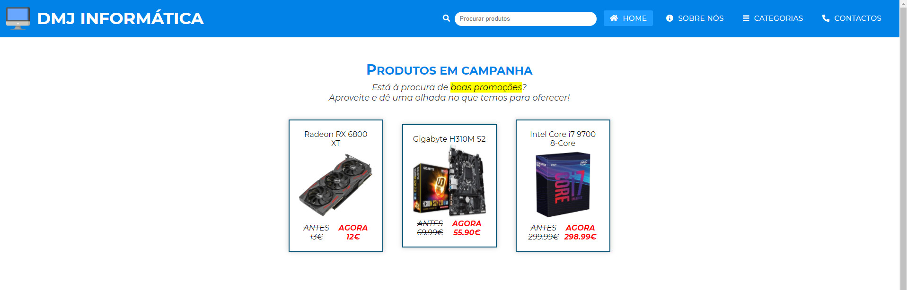
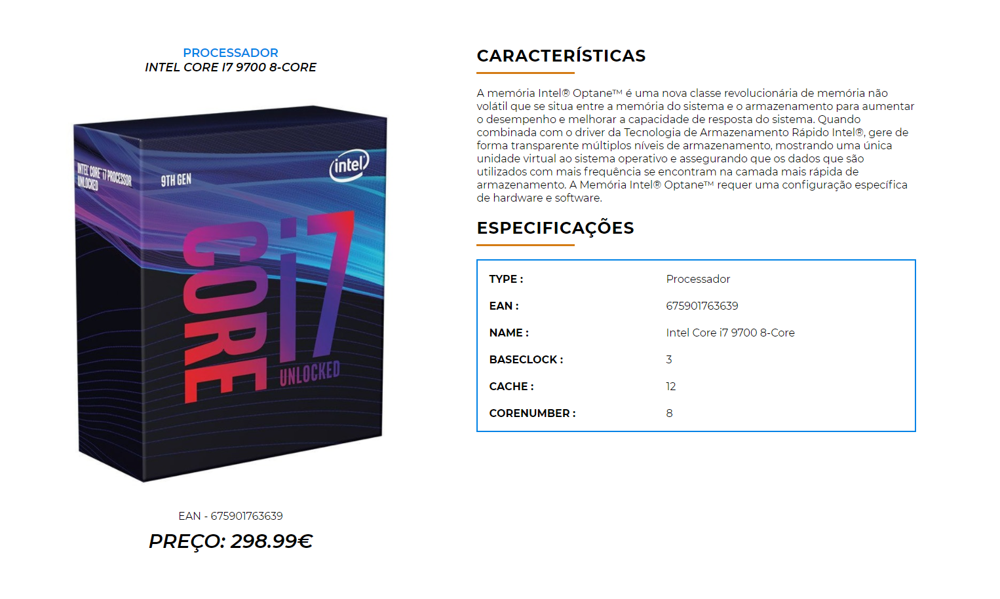

# Trabalho Prático M1 - DMJ Informática
Repositório criado no âmbito do trabalho prático M1, da disciplina de Técnologias Internet. Desenvolvido por [@ElCastrinho](https://github.com/ElCastrinho), [@Johnnyzao](https://github.com/Johnnyzao) e [@marcoftmartins](https://github.com/marcoftmartins).

## Breve Descrição

O objetivo primordial deste site era conseguir fazer uma loja de informática, que contivessem abas de ligação entre páginas, artigos, descrição de artigos, formulário de contactos com a ideia de uma venda de produtos deste mesmo meio.

## Organização do Repositório

* O código do site encontra-se na pasta [dmj-informatica](https://github.com/TIWM-TI01/dmj-informatica/tree/main/dmj-informatica).
* Os restantes documentos de apoio estão na pasta [docs](https://github.com/TIWM-TI01/dmj-informatica/tree/main/docs).

## Galeria

## Tecnologias Utilizadas

* HTML5 + CSS3
* XML
* Javascript

## Report

### Apresentação do Projeto
* C1: [Apresentação do Projeto](docs/apresentacao-projeto.md)
### Interface com o utilizador 
* C2: [Interface](docs/interface-utilizador.md)
### Produto
* C3: [Produto](docs/produto.md)
### Apresentação
* C4: [Apresentação](docs/dmj-informatica.pdf)

## Equipa
* Diogo Filipe Sousa Castro [@ElCastrinho](https://github.com/ElCastrinho)
* João Paulo Teixeira Carvalho [@Johnnyzao](https://github.com/Johnnyzao)
* Marco Filipe Teixeira Martins [@marcoftmartins](https://github.com/marcoftmartins)
