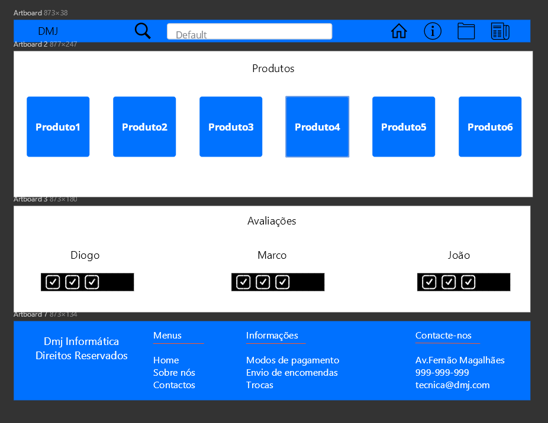

#Criação de uma sketch e um Sitemap

## Sketchs

| | |
:---: | :---:
 | 
Always add a description to help the user understand the figure |  Always add a description to help the user understand the figure 

## Sitemap

_Add a diagram of your (Visual) sitemap. I'm not expecting a [XML Sitemap](https://developers.google.com/search/docs/advanced/sitemaps/build-sitemap#expandable-1) ([Wikipedia](https://en.wikipedia.org/wiki/Sitemaps))_  
