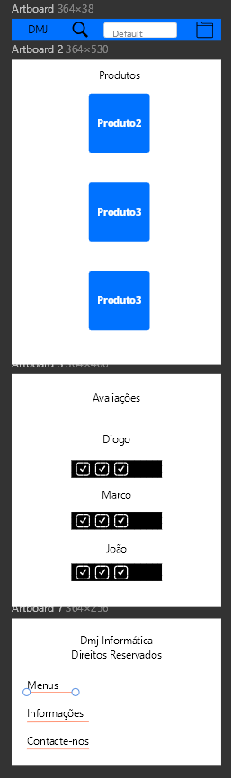

# Criação de uma Sketch e de um Sitemap

## Sketchs

| | |
:---: | :---:
 | 
Aqui podemos ver a sketch da nossa página principal. |  Nesta imagem podemos ver uma primeira impressão do nosso mobile first. 

## Sitemap

_Add a diagram of your (Visual) sitemap. I'm not expecting a [XML Sitemap](https://developers.google.com/search/docs/advanced/sitemaps/build-sitemap#expandable-1) ([Wikipedia](https://en.wikipedia.org/wiki/Sitemaps))_  

---
[< Previous](apresentacao-projeto.md) | [^ Main](https://github.com/TIWM-TI01/dmj-informatica) | [Next >](produto.md)
:--- | :---: | ---: 
