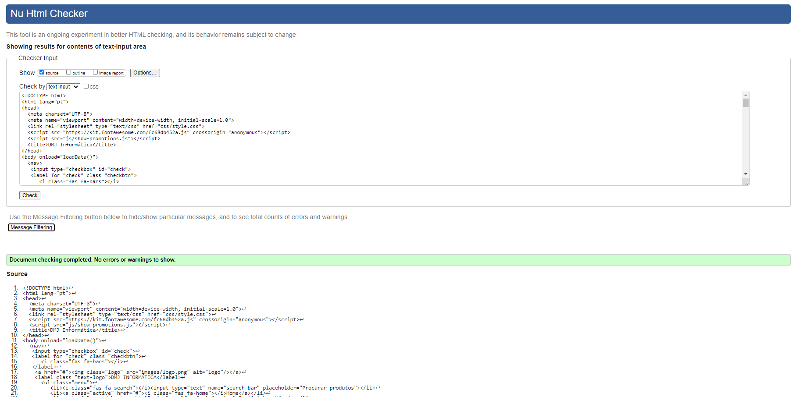

## Produto

O nosso site está dividido em 4 grandes partes: Home, Produto, Sobre nós e Contactos.
Na página principal temos acesso aos produtos que se encontram em promoção. Caso queiramos saber mais sobre um determinado produto, basta clicar no mesmo e seremos rederecionados para outra página onde estão descritas as caracteristicas e especificações completas do mesmo. Ainda na página inicial temos uma pequena seção onde os podemos consultar algumas reviews deixadas no nosso site pelos nossos clientes. 
Na aba "Sobre Nós" encontramos uma breve descrição sobre quem somos, o que fazemos e o nosso objectivo.
E finalmente na parte dos contactos, temos informações acerca da nossa loja, como a sua morada com o respetivo mapa e direções. Temos ainda um formulário para contactos, caso o cliente pretenda algum esclarecimento sobre algum assunto relacionado com a loja. Para isso basta preencher com os seus dados pessoais e entraremos em contacto o mais breve possível.

## Validação do HTML5 e do CSS3

Para a validação do código HTML5 e CSS3, foi usado o [W3C Validator](https://validator.w3.org/)

## Implementação dos requisitos

### HTML

1- [Tabela](requisitos/html/Tabelas.png)

2- [Lista](requisitos/html/Listas.png)

3- [Marcação(strong, mark)](requisitos/html/Strong_mark.png)

4- [Imagens](requisitos/html/ImageCaption.png)

5- [Ligação Interna](requisitos/html/LigaçõesInternas.png)

6- [Ligação Externa](requisitos/html/LigaçõesExternas.png)

7- [Formulário](requisitos/html/Formulário.png)

### CSS

1- Seletores Simples [a](requisitos/css/Css.png) // [b](requisitos/css/Screenshot_1.png) // [c](requisitos/css/Screenshot_2.png) // [d](requisitos/css/Screenshot_3.png)

2- [Seletor Pseudo-elemento](requisitos/css/Elemento.png)

3- Propriedades [a](requisitos/css/Text.png) // [b](requisitos/css/Fonte.png)

4- [Formatação da Lista](requisitos/css/.png)

5- [Formatação da Página](requisitos/css/Footer.png)

6- [Manipulação de 4 elementos](requisitos/css/ElementosHtml.png)

7- Float e Position [a](requisitos/css/Floar.png) // [b](requisitos/css/Position.png) // [c](requisitos/css/Position_floar.png)

8- [Esconder Elemento](requisitos/css/Esconder_Elemento.png)

9- [Formatação de uma Table](requisitos/css/Formatação_Tabela.png)

10- [Substituição de um Elemento](requisitos/css/Substituição_elemento_imagem.png)

11- [Responsividade de Ecrã](requisitos/css/Media_Queries.png)

---
[< Previous](interface-utilizador.md) | [^ Main](https://github.com/TIWM-TI01/dmj-informatica) | [Next >](produto.md)
:--- | :---: | ---: 
